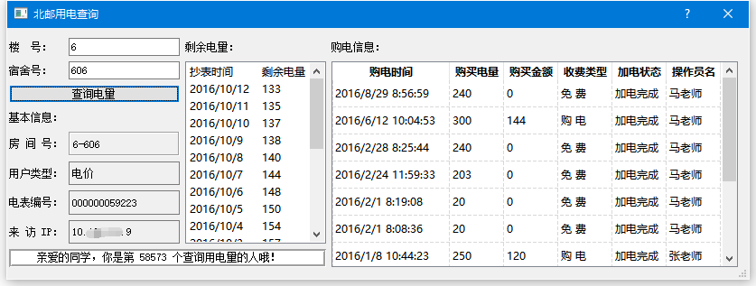

# BUPT-ydcx
## BUPT宿舍 用电查询 软件.

此软件是用qt写的，还在逐步完善当中。

虽然只是简单的电量查询，但是对于qt学习，布局，控件的使用还是有一定帮助哦。

**注：**电量查询网址为：ydcx.bupt.edu.cn . 经本人测试，有若干宿舍楼无法查询用电信息，非此软件Bug。如果有遇到网页能查而此软件查不了的，烦请告知。

**遗留问题：**当宿舍电量低于30度时，网页会弹出警告窗口，点击“确认”后才进入正常的展示页。本人目前还未处理此问题。因此，对于电量低于30度的情况，此软件还未特殊处理，会有一些Bug。

